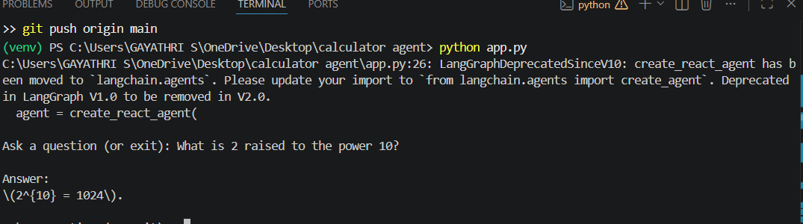

# Calculator Agent using LangChain and Groq

## Overview

This project is a Calculator Agent built using LangChain and Groq LLM.

The agent can:

- Perform mathematical calculations
- Use a calculator tool
- Return accurate results
- Interact with users through the terminal

## Technologies Used

- Python
- LangChain
- LangGraph
- Groq
- python-dotenv

## Project Structure

```
calculator-agent-langchain-groq/
│
├── app.py
├── requirements.txt
├── README.md
├── .gitignore
└── .env
```

## Installation

### 1. Clone the repository

```bash
git clone https://github.com/Gayathri-ar/calculator-agent-langchain-groq.git
```

### 2. Navigate to the project folder

```bash
cd calculator-agent-langchain-groq
```

### 3. Create a virtual environment

```bash
python -m venv venv
```

### 4. Activate virtual environment

Windows:

```bash
venv\Scripts\activate
```

### 5. Install dependencies

```bash
pip install -r requirements.txt
```

### 6. Create a .env file

```env
GROQ_API_KEY=your_api_key_here
```

### 7. Run the application

```bash
python app.py
```

---

## Example Usage

### Input

```text
What is 25 * 12?
```

### Output

```text
300
```

### Input

```text
What is 2 raised to the power 10?
```

### Output

```text
1024
```

---

## Screenshots

Add screenshots here after running the project.

Example:



---

## Author

Gayathri S

B.Tech Data Science Engineering